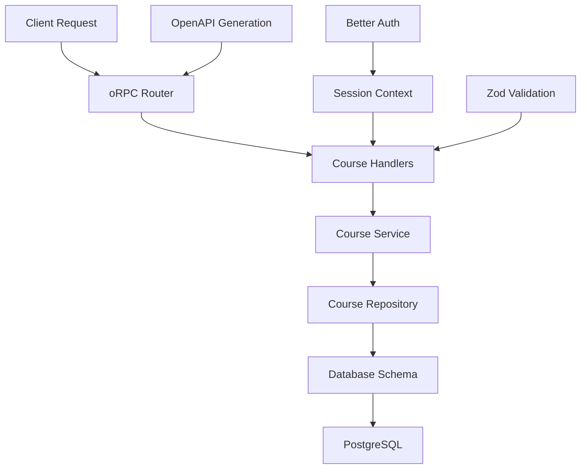

# Design Document

## Overview

The Course CRUD feature provides comprehensive course management capabilities for the LMS platform with public CRUD operations and private enrollment functionality. This feature follows the project's established patterns using oRPC for type-safe API contracts, Drizzle ORM for database operations, and Better Auth for authentication where needed. The implementation leverages the existing feature-based organization with _api folders and follows the abstract class pattern for services and repositories.

## Steering Document Alignment

### Technical Standards (tech.md)
The design follows documented technical patterns:
- **oRPC Contract-First**: API contracts defined using `oc` builder with implementation via `implement()`
- **Abstract Class Pattern**: Services, repositories, and schemas organized as abstract classes with static methods
- **4-Layer Schema Organization**: BaseSchemas, InputSchemas, OutputSchemas, ValidationSchemas
- **Repository Parameter Convention**: Database parameter passed as first argument for dependency injection
- **Feature-First Colocation**: Code lives within feature directories, moving up only when needed

### Project Structure (structure.md)
Implementation follows project organization conventions:
- **Route Organization**: Following `/routes/courses/-app/` pattern for API handlers
- **Import Patterns**: Absolute imports with proper ordering and module boundaries
- **Code Structure Patterns**: Abstract class organization for clean namespace access
- **Database Schema**: Located in `/lib/db/schema/` with proper relationships

## Code Reuse Analysis

### Existing Components to Leverage
- **oRPC Infrastructure**: `@lib/orpc/index.ts` - publicProcedure and protectedProcedure patterns
- **Database Context**: `@lib/orpc/context.ts` - existing db and session context creation
- **Auth Integration**: Better Auth session management for private endpoints
- **Todo Pattern**: `@routes/todos/-app/` - reference implementation for CRUD operations
- **Database Schema**: `@lib/db/schema/index.ts` - existing schema export patterns

### Integration Points
- **User Schema**: Reference for createdBy field relationship and user authentication
- **oRPC Router**: Integration into main router at `@lib/orpc/router/index.ts`
- **Database Connection**: Shared database instance through context
- **Error Handling**: Consistent error patterns using ORPCError and proper HTTP status codes

## Architecture

The architecture follows Clean Architecture principles with clear separation of concerns:

### Modular Design Principles
- **Single File Responsibility**: Each CRUD operation in separate handler files
- **Component Isolation**: Database schema, validation, and API handlers in focused files
- **Service Layer Separation**: Business logic isolated in service classes
- **Utility Modularity**: Validation schemas organized in abstract classes



## Components and Interfaces

### Database Schema Component
- **Purpose:** Define course and enrollment data structures
- **Interfaces:** Course and Enrollment table definitions
- **Dependencies:** User schema for createdBy relationship
- **Reuses:** Existing UUID generation and timestamp patterns

### oRPC Contract Component
- **Purpose:** Define type-safe API contracts with input/output schemas
- **Interfaces:** Course CRUD and enrollment endpoints
- **Dependencies:** Zod schemas for validation
- **Reuses:** Existing oRPC patterns and error definitions

### Service Layer Component
- **Purpose:** Implement business logic and validation rules
- **Interfaces:** Static methods for course operations and enrollment management
- **Dependencies:** Repository layer and validation schemas
- **Reuses:** Abstract class pattern from existing codebase

### Repository Layer Component
- **Purpose:** Handle database operations and data persistence
- **Interfaces:** Static methods with database parameter injection
- **Dependencies:** Drizzle ORM and database schema
- **Reuses:** Repository parameter convention and query patterns

### API Handler Component
- **Purpose:** Implement oRPC endpoint handlers
- **Interfaces:** Context-aware handlers with validation
- **Dependencies:** Service layer and oRPC contracts
- **Reuses:** Existing handler patterns from todo implementation

## Data Models

### Course Model
```typescript
interface Course {
  id: string; // UUID primary key
  name: string; // Required course name
  price: number; // Numeric with 2 decimal places
  categoryTag: string[]; // Array containing "prakerja" and/or "spl"
  thumbnail?: string; // Optional URL string
  rating?: number; // Optional 1-5 scale with 1 decimal place
  createdBy?: string; // Optional UUID foreign key to user
  createdAt: Date; // Auto-generated timestamp
  updatedAt: Date; // Auto-generated timestamp
}
```

### Enrollment Model
```typescript
interface Enrollment {
  id: string; // UUID primary key
  userId: string; // Foreign key to user
  courseId: string; // Foreign key to course
  enrolledAt: Date; // Auto-generated timestamp
}
```

### Input Schemas
```typescript
interface CreateCourseInput {
  name: string; // Required, non-empty
  price: number; // Required, non-negative
  categoryTag: string[]; // Required, contains valid categories
  thumbnail?: string; // Optional URL
  rating?: number; // Optional 1-5 scale
}

interface UpdateCourseInput {
  name?: string; // Optional
  price?: number; // Optional
  categoryTag?: string[]; // Optional
  thumbnail?: string; // Optional
  rating?: number; // Optional
}
```

### Output Schemas
```typescript
interface CourseResponse {
  id: string;
  name: string;
  price: number;
  categoryTag: string[];
  thumbnail?: string;
  rating?: number;
  createdBy?: string;
  createdAt: Date;
  updatedAt: Date;
}

interface CourseListResponse {
  courses: CourseResponse[];
  total?: number;
}
```

## Error Handling

### Error Scenarios

1. **Validation Errors**
   - **Handling:** Zod schema validation with detailed error messages
   - **User Impact:** Returns 400 status with field-specific validation errors

2. **Course Not Found**
   - **Handling:** Repository returns null, handler throws ORPCError with NOT_FOUND
   - **User Impact:** Returns 404 status with clear "Course not found" message

3. **Database Errors**
   - **Handling:** Try-catch blocks with proper error logging and generic error response
   - **User Impact:** Returns 500 status with "Internal server error" message

4. **Authentication Errors (Enrollment/MyCourses)**
   - **Handling:** Protected procedure middleware validates session
   - **User Impact:** Returns 401 status with "Authentication required" message

5. **Duplicate Enrollment**
   - **Handling:** Service layer checks existing enrollment before creation
   - **User Impact:** Returns 409 status with "Already enrolled" message

## Testing Strategy

### Unit Testing
- Test all service layer business logic methods
- Test repository layer database operations with mock database
- Test validation schemas with valid and invalid inputs
- Test error handling scenarios and edge cases

### Integration Testing
- Test oRPC endpoint handlers with actual database
- Test authentication flows for protected endpoints
- Test course CRUD operations end-to-end
- Test enrollment workflows with user sessions

### End-to-End Testing
- Test complete course creation to enrollment workflow
- Test public course discovery and browsing
- Test authenticated user enrollment management
- Test error scenarios from client perspective
